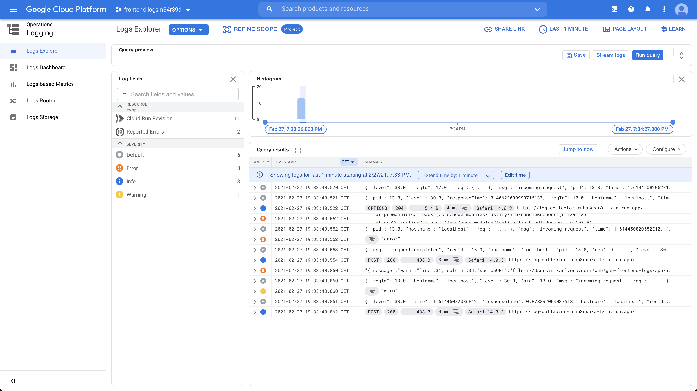
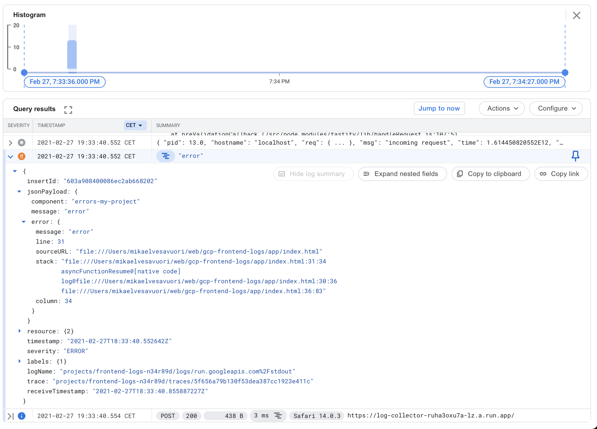
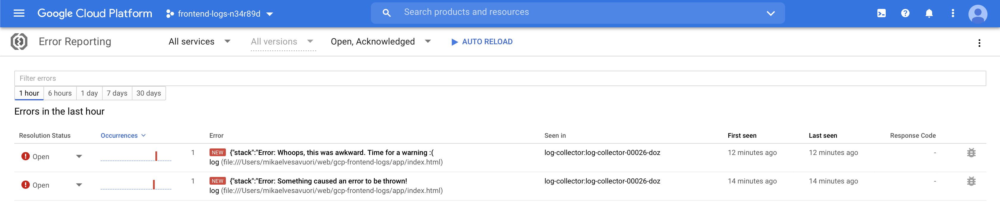
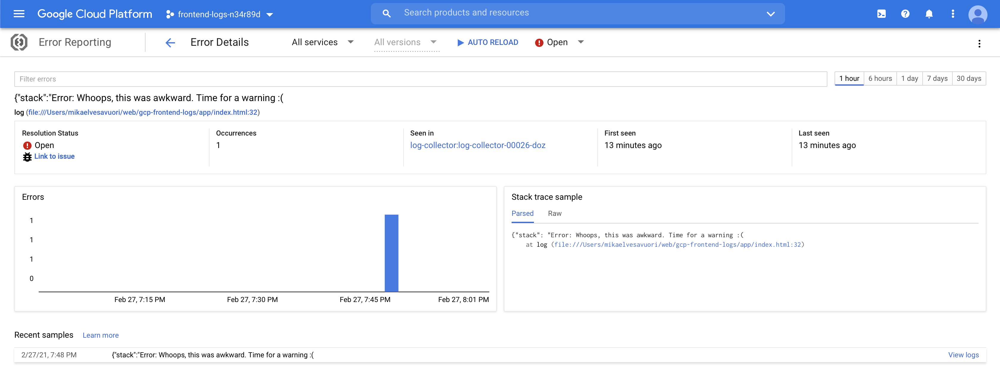

# GCP error reporting: Front-end -> Back-end -> Cloud Error Reporting & Trace & Logging

Demonstrates sending front-end errors to GCP monitoring tools. So while something like Sentry might be a very fine tool, it's sometimes a lot simpler, more straightforward or simply just cheaper to use what you have at hand.

The front-end is a vanilla HTML page with a tiny Javascript section. Clicking the buttons ("error" or "warn") sends one of these _errors_ to the back-end so we can monitor, collect and act on them.

The log collector (back-end) is a Fastify API (Node 14) with a single endpoint.

Services that are part of this demo:

- [Error Reporting](https://cloud.google.com/error-reporting/) to collect errors
- [Cloud Logging](https://cloud.google.com/logging) to collect logs
- [Cloud Trace](https://cloud.google.com/trace) to enable observability of how our service operated
- [Cloud Run](https://cloud.google.com/monitoring) which will host our serverless back-end service
- [Cloud Build](https://cloud.google.com/build) to act as CI tool

## Google Cloud Platform observability services

Cloud Logging will give you great tools to fetch and dive into logs.



We also ensure that logs are created in a way that ends up with GCP being able to show structured logs.



The actual errors are surfaced to Error Reporting.



It's easy to get a view of an error and its (hopefully short) life-cycle.



Finally, you can also trace the service. Seems overkill, but why not?


## Prerequisites

You will need:

- A GCP account
- Sufficient access rights to create projects and resources
- GCP credentials available through environment (or similar) so tooling can work as intended

## Instructions

### Prepare

Go over the scripts in `src/scripts` first and set any values that need to be unique/your own.

Install dependencies with `npm install` both in the root, and inside `/src`.

You can set `LOGGING_COMPONENT` (in `src/index.js`) to point to your "container" or readable "project" name for logs; else it will get a basic demo value.

### Local development

You'll need to set `KEYFILE_PATH` in `src/index.js` to point to a local JSON keyfile. [Read here if you need to learn how that works](https://cloud.google.com/iam/docs/creating-managing-service-account-keys). This solution is admittedly a bit dirty, so I'd advise you to not deploy anything with this bit still in the code, but it does do the job while you muck about locally.

Run `npm start` inside the `src` folder to start the server locally.

Use the below example payloads or use the frontend app in `app/index.html` to use the service. If using the frontend, don't forget to repoint your Fetch call to your own Cloud Run endpoint or to your localhost.

### Initialize

Run `sh scripts/init.sh`. You should set the file up before-hand and you'll probably want to run it bit-by-bit since you need to get values along the way (such as the billing account ID).

At the end of this process, you'll have a new GCP project, a Git repo, Cloud Build CI pipeline, a service account. Some of these are billable components, but you should expect essentially zero cost in reality.

### Deploying

After initializing, every successive push to the Git repo (in GCP) will kick-start a CI build resulting in a deployment and release of the backend service.

As an alternative, you _can_ deploy only the service, if you want. It's the easiest option if you already have all your stuff set up. If that's good with you, just run `sh scripts/deploy.sh`.

### Teardown (remove) service

Run `sh scripts/teardown.sh`. This will tear the whole project down, and does assume you did init the project as per above.

## Example payloads

### Error

```
POST 0.0.0.0:8080 or Cloud Run endpoint
{
	"severity": "error",
	"message": "Something caused an error to be thrown!",
	"error": "{\"stack\":\"Error: Something caused an error to be thrown!\n    at log (file:///Users/YOUR_NAME/web/gcp-frontend-logs/app/index.html:32:25)\n    at HTMLButtonElement.<anonymous> (file:///Users/YOUR_NAME/web/gcp-frontend-logs/app/index.html:38:80)\",\"message\":\"Something caused an error to be thrown!\"}"
}
```

### Warn

```
POST 0.0.0.0:8080 or Cloud Run endpoint
{
	"severity": "warn",
	"message": "Whoops, this was awkward. Time for a warning :(",
	"error": "{\"stack\":\"Error: Whoops, this was awkward. Time for a warning :(\n    at log (file:///Users/YOUR_NAME/web/gcp-frontend-logs/app/index.html:32:25)\n    at HTMLButtonElement.<anonymous> (file:///Users/YOUR_NAME/web/gcp-frontend-logs/app/index.html:39:79)\",\"message\":\"Whoops, this was awkward. Time for a warning :(\"}"
}
```

## References

- [https://www.npmjs.com/package/@google-cloud/error-reporting](https://www.npmjs.com/package/@google-cloud/error-reporting)
- [https://medium.com/google-cloud/whats-the-best-way-to-log-errors-in-node-js-b3dfd2fe07a7](https://medium.com/google-cloud/whats-the-best-way-to-log-errors-in-node-js-b3dfd2fe07a7)
- [https://medium.com/google-cloud/collecting-browser-console-logs-in-stackdriver-fa388a90d32b](https://medium.com/google-cloud/collecting-browser-console-logs-in-stackdriver-fa388a90d32b)
- [https://cloud.google.com/logging/docs/reference/libraries#client-libraries-install-nodejs](https://cloud.google.com/logging/docs/reference/libraries#client-libraries-install-nodejs)
- [https://mattcbaker.com/posts/stringify-javascript-error/](https://mattcbaker.com/posts/stringify-javascript-error/)
- [https://cloud.google.com/run/docs/logging#writing_structured_logs](https://cloud.google.com/run/docs/logging#writing_structured_logs)
